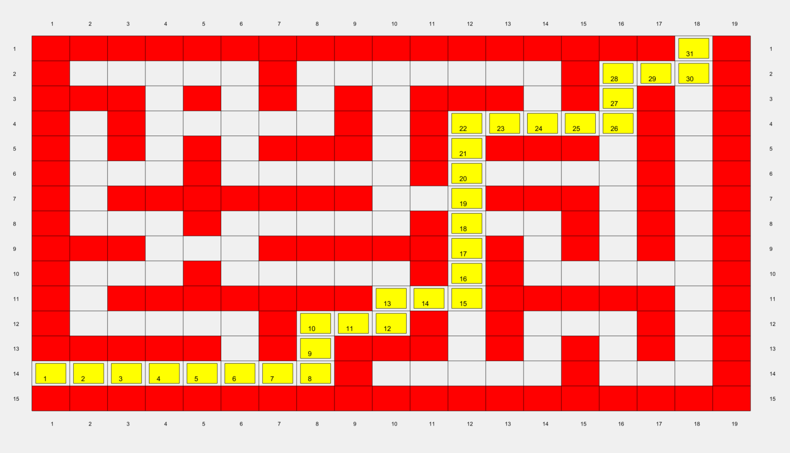
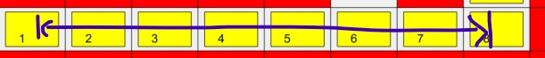
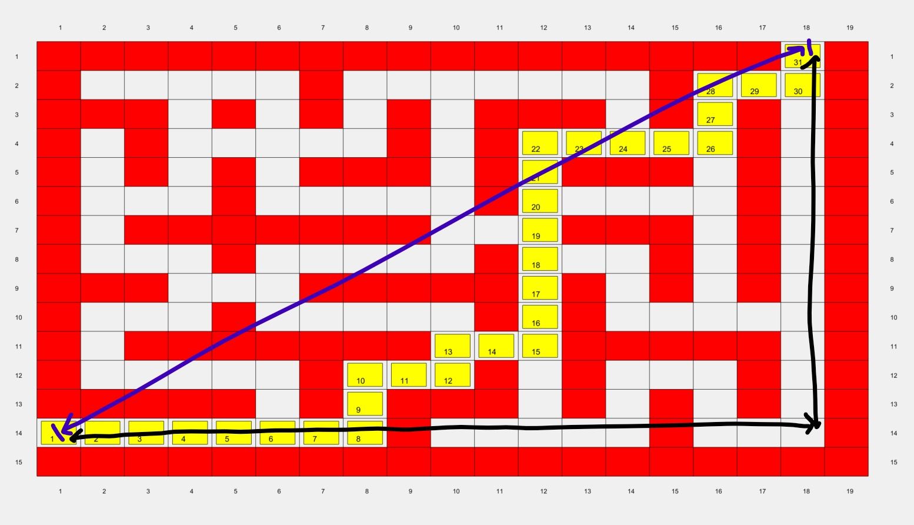

# A_Star_Algorithm
Implementation of the A* Pathfinding algorithm in MATLAB

## Instructions

To run this algorithm, you must download all the files (graphics folder not necessary) into one directory, and then run the main.m file. Edits can be made to the main.m file to modify the map and/or the start and goal coordinates. 

This A* Algorithm takes the following 5 inputs:
- startCol - this is the column value for the starting position
- startRow - this is the row value for the starting position
- goalCol - this is the column value for the goal position
- goalRow - this is the row value for the goal position
- map - this is the matrix that represents the map (NOTE: you will have to use the map_convert function from the provided MATLAB codebase to store this as a matrix)

Note: the end positions for the two provided maps in (row, col) format are as follows:
- map_8.txt -> (14,1) & (1, 18)
- map_1.txt -> (2, 2), (6, 2), (10, 2) & (12, 6)

Note that the algorithm currently moves through all spaces with a value of '0'. If you would like to change this behaviour, edit the value of the **Obstruction** variable.

## Outputs

By default, the main.m file outputs the time it takes for the a_star() function to run, as well as prints out the map and the calculated route as seen below:

The a_star.m file itself outputs a list of coordinates from the goal coordinate to the start coordinate. The list will be of the size (numOfElementsInMap, 2). The first column of each row will hold a row coordinate value, and the second column will hold a column coordinate value.

The list of neighbors/nodes in the optimal path is outputted in order from the start to the goal node. The code also has the functionality to plot the path onto a graph.

If you would also like to output each row and column as the algorithm goes to it, then uncomment lines 56 to 59 in the a_star.m file.

## How A* works

The basic idea behind the A* algorithm is defined by the equation **F = G + H**. 

In this equation, **G** is the distance between the current node and the start node. This is essentially calculated by adding a new distance to the existing G Cost of the current node as we move to the next node. For example, in the image below, the blue line represents the G Cost at node 8, if travelling from node 1:

The **H** refers to the from the current node to the end node. While this can be calculated accurately, it is time consuming and computationally expensive. Therefore, a approximation/heuristic is used. For this A* implementation, I have used Euclidean distance to calculate the H Cost. For example, in the image below, the blue line represents the F Cost from node 1, while the black lines represent the distances thatare required to calculate the F Cost:

For every current node, the A* algorithm calculates the **F** values (i.e. the total cost of the node) of all its neighbours in the four cardinal directions. It then updates the F cost values on the fCost map and chooses the minimum fCost for the next current node. What this essentially means is that the algorithm has a sense of direction - H cost will be lower as you move closer to the goal, so the F cost will likely also be lower as you move towards the goal.

Therefore, the A* algorithm chooses the optimal decision at each step that will both be the shortest route (due to the G Cost component), and will always attempt to move closer to the goal as it is calculating (due to the F Cost). This also makes A* more efficient than the likes of Dijkstras (on which it is based) as the algorithm does not have to explore all possible routes, but rather focus on moving towards the goal.

For this particular implementation, I have limited the algorithm's possible moves to the four cardinal directions - avoiding any diagonal movement. This was because there is no need for diagonal movement in the PACMAN map for which this algorithm is being tested. However, in order to add the diagonal movement functionlity, simple add more 'move' vectors into the moves matrix on line 39 of a_star.m, and increase the upper bound of the for loop on line 72 of the same file.
